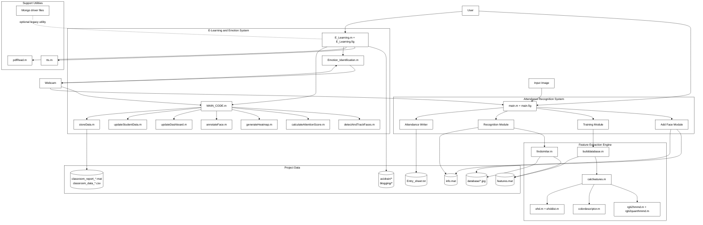
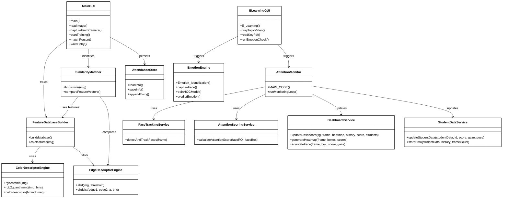
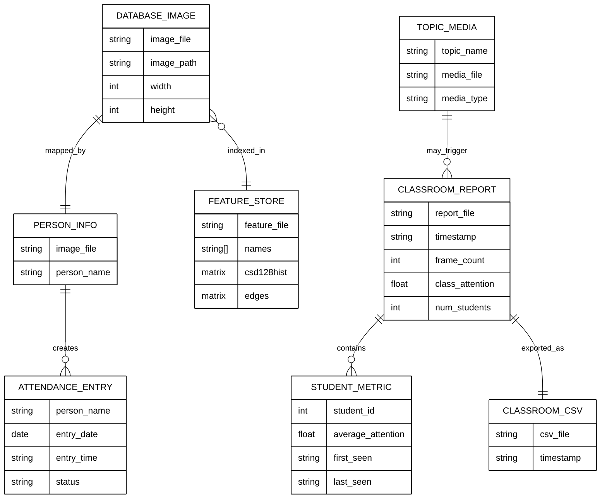
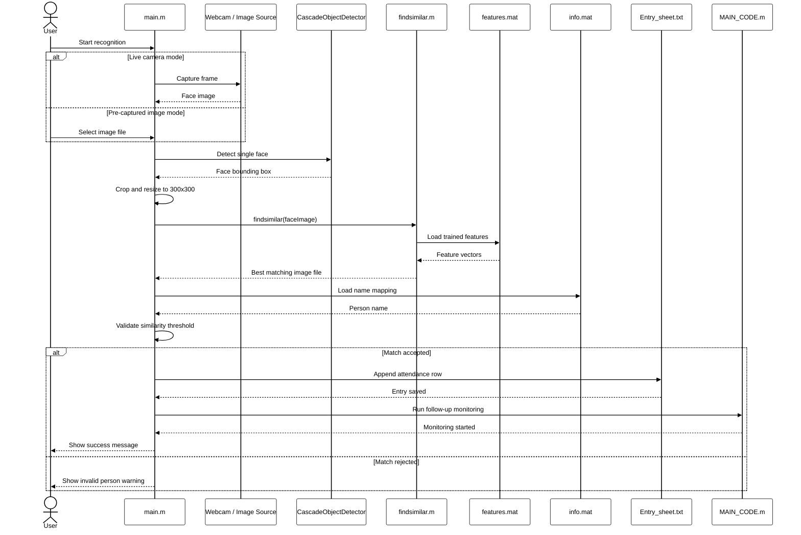

# Face Entry Project Diagrams

These diagrams are based on the modules present in this project folder.
They are organized to reflect the actual MATLAB source files, data files, media assets, and generated outputs.

All diagrams use a black and white style and keep labels short to reduce text collisions.

## 1. Architecture Diagram

### Purpose
This diagram shows the major subsystems, how users interact with them, and how source modules connect to data, devices, and outputs.

### Symbols Used
- Rectangle: application module or subsystem
- Cylinder-like node name: logical data store
- Arrow: data flow or control flow
- Group box: related project area

## 2. Class Diagram

### Purpose
This diagram models the project as logical classes/modules. The codebase is largely procedural MATLAB, so these are module-level classes rather than MATLAB `classdef` domain classes.

### Symbols Used
- Box with compartments: logical class/module
- `+` method: publicly used operation
- Arrow with open head: dependency or usage
- Diamond relation is avoided here to keep the layout clean

## 3. ER Diagram

### Purpose
This diagram shows the project data model: stored images, feature files, identity mappings, attendance logs, and classroom monitoring outputs.

### Symbols Used
- Entity box: stored data object
- Attributes inside box: important fields
- Relationship line: association between entities
- Cardinality labels: one-to-one or one-to-many

## 4. Sequence Diagram

### Purpose
This diagram shows the main attendance-recognition flow from user action to attendance entry creation. It uses the actual project modules involved in the successful recognition path.

### Symbols Used
- Participant: actor, module, or store
- Vertical dashed line: lifeline over time
- Solid arrow: synchronous call
- Dashed arrow: return/result
- `alt`: decision branch

## Notes About Diagram Interpretation

- The project is not fully object-oriented. The class diagram is a logical design view derived from MATLAB modules.
- The ER diagram reflects how files and saved data behave as entities in this project.
- The sequence diagram focuses on the core attendance path because that is the most complete and consistent workflow in the codebase.
- The architecture diagram includes both the attendance system and the e-learning/emotion subsystem because both are present in the same project folder.

## Module Coverage Reference

Included project modules:
- `main.m`, `main.fig`
- `E_Learning.m`, `E_Learning.fig`
- `MAIN_CODE.m`
- `Emotion_Identification.m`
- `detectAndTrackFaces.m`
- `calculateAttentionScore.m`
- `generateHeatmap.m`
- `annotateFace.m`
- `updateDashboard.m`
- `updateStudentData.m`
- `storeData.m`
- `codes/builddatabase.m`
- `codes/findsimilar.m`
- `codes/calcfeatures.m`
- `codes/colordescriptor.m`
- `codes/ehd.m`
- `codes/ehddist.m`
- `codes/rgb2hmmd.m`
- `codes/rgb2quanthmmd.m`
- `pdfRead.m`
- `tts.m`
- Mongo utility files as optional legacy support
